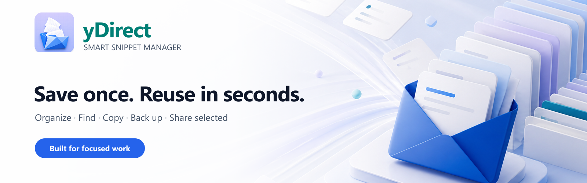
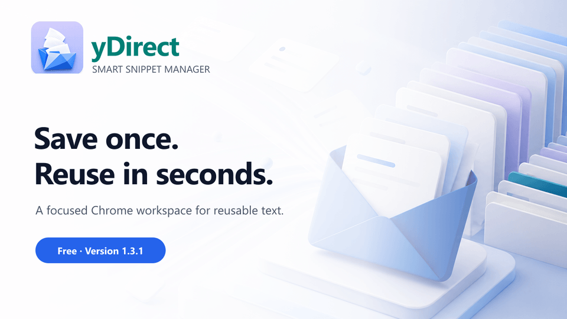
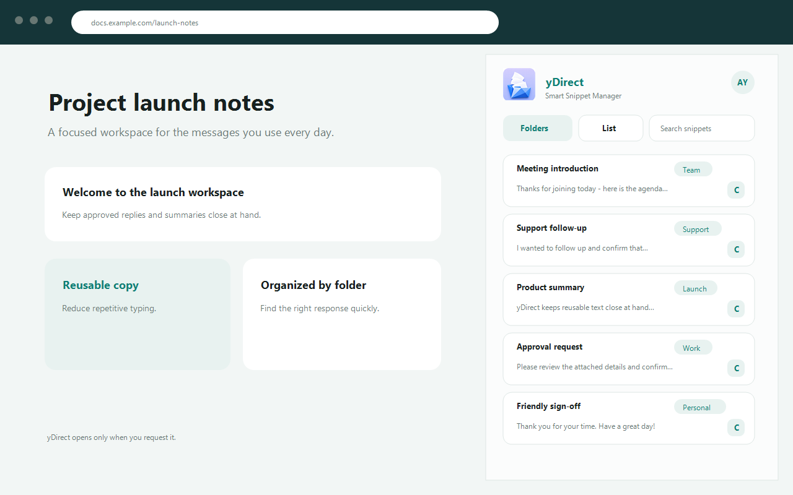
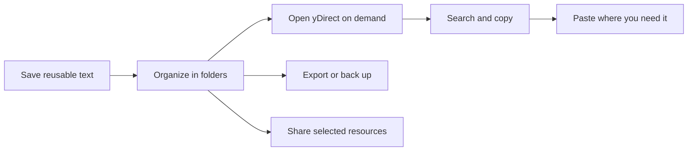
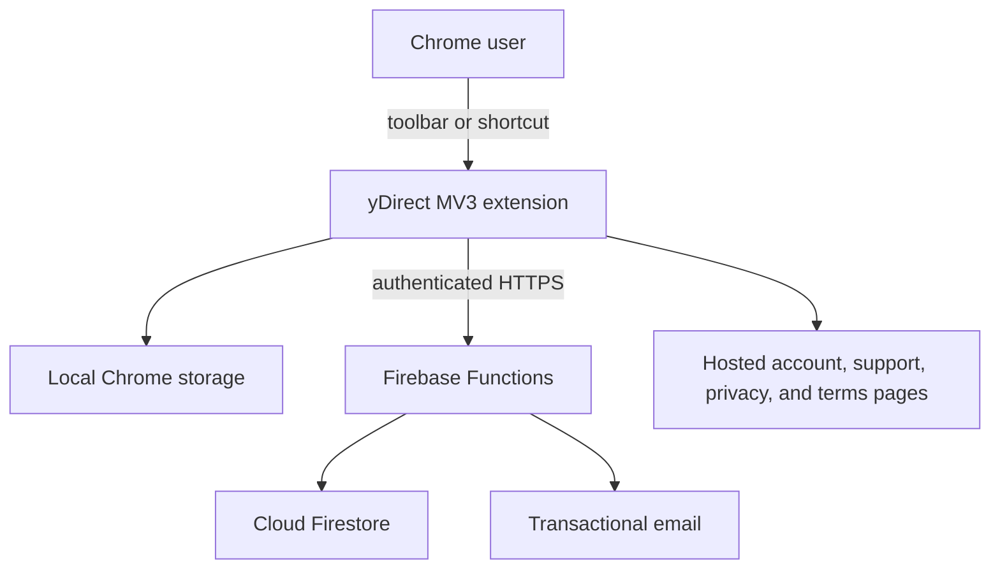

# yDirect — Smart Snippet Manager

  
  
  
  
  

  <strong>Save once. Reuse in seconds.</strong> 
  A focused Chrome workspace for the text you use every day—organized, searchable, portable, and ready in two clicks or fewer.

  <a href="#why-ydirect">Why yDirect</a> ·
  <a href="#product-tour">Product tour</a> ·
  <a href="#features">Features</a> ·
  <a href="#installation">Installation</a> ·
  <a href="#technology">Technology</a> ·
  <a href="docs/PRIVACY-AND-PERMISSIONS.md">Privacy</a> ·
  <a href="https://inksl-ay.firebaseapp.com/support.html">Support</a>

> [!IMPORTANT]
> This is yDirect's public product and documentation repository. The production extension source code, backend source, secrets, and release packages are intentionally kept in a separate private repository.

## Why yDirect?

The same replies, prompts, links, explanations, and templates get typed again and again. Keeping them in scattered notes makes them slow to find, difficult to share safely, and easy to lose.

yDirect turns that repeated text into a small, on-demand workspace attached to the right edge of the page you are already using. Open it only when needed, find the right snippet, copy it, and continue working without changing tabs.

| What | Why | How | Who |
| --- | --- | --- | --- |
| A smart snippet manager for Chrome | Reduce repetitive typing and context switching | Save, organize, search, copy, back up, export, and selectively share reusable text | Support, sales, recruiting, founders, developers, creators, students, and anyone who repeats text |

## Product tour

  <a href="assets/demo/ydirect-product-tour.webm">Watch the higher-quality product tour</a> ·
  <a href="docs/FEATURES.md">Explore every feature</a>

## Features

| | Capability | What it gives you |
| --- | --- | --- |
| ⚡ | Fast access | Open from the toolbar or `Alt+S`; copy a snippet in two clicks or fewer. |
| 🗂️ | Clear organization | Folder and list views, search, sorting, timestamps, labels, and copy counts. |
| 📋 | Reliable copying | One-click copy plus `Alt+C` for the most recently used snippet. |
| 👁️ | Optional masking | Reduce casual shoulder-surfing when text is visible on screen. Masking is not encryption. |
| 💾 | Local-first storage | Keep day-to-day snippet data in Chrome storage, separated by signed-in account. |
| ☁️ | Optional cloud backup | Store the latest successful backup and one previous recovery point. |
| 🔐 | Portable backups | Import and export JSON, passphrase-encrypted JSON, and Excel workbooks. |
| 🤝 | Selective collaboration | Share only chosen folders or snippets with verified yDirect accounts. |
| 🌓 | Comfortable UI | Light and dark themes with keyboard-accessible dialogs. |
| 🧭 | On-demand page access | The attached workspace is inserted only after a toolbar click or shortcut. |

See [Features](docs/FEATURES.md) for behavior, limits, roles, and safety notes.

## Who is it for?

- **Customer support:** keep consistent troubleshooting steps and approved replies close at hand.
- **Sales and recruiting:** organize outreach, follow-ups, qualification questions, and scheduling messages.
- **Founders and operators:** reuse product explanations, launch copy, status updates, and routine communications.
- **Developers:** store commands, review checklists, code-review phrases, and issue templates—not secrets.
- **Creators and students:** manage captions, research notes, prompts, citations, and frequently reused links.
- **Teams:** share selected resources without exposing an entire personal library.

## How it works

The browser page never receives your library. The workspace runs in an extension-owned frame and page access is requested only after your gesture. Read the [privacy and permissions explanation](docs/PRIVACY-AND-PERMISSIONS.md) for the exact model.

## Installation

### Chrome Web Store

yDirect `1.3.1` was submitted for Chrome Web Store review on **August 11, 2026** with manual publishing selected. The public install button will be added here as soon as the review is approved and the owner completes the final launch check.

When published:

1. Open the yDirect Chrome Web Store listing and choose **Add to Chrome**.
2. Pin yDirect from Chrome's Extensions menu.
3. Open a normal `http://` or `https://` page and click the yDirect icon, or press `Alt+S`.
4. Register with email or continue with Google, then verify the account if prompted.
5. Create a folder and your first snippet. Use the copy button or press `Alt+C` to copy the last-used snippet.

No unsigned package or private-source installation is distributed from this public repository. See [Installation](docs/INSTALLATION.md) for supported-page behavior and troubleshooting.

## Privacy by design

- No advertising and no sale of user data.
- No browsing-history collection.
- No persistent permission to read every website.
- Optional automatic backup is off until the user enables it.
- Cloud and sharing actions require an authenticated, verified account.
- Export happens only after a user selects an export action.
- The extension package contains no remotely downloaded executable code.

yDirect is not a password manager. Do not store passwords, card data, private keys, recovery codes, regulated records, or other highly sensitive secrets as ordinary snippets.

[Privacy Policy](https://inksl-ay.firebaseapp.com/privacy.html) · [Terms of Service](https://inksl-ay.firebaseapp.com/terms.html) · [Permission details](docs/PRIVACY-AND-PERMISSIONS.md)

## Technology

yDirect is a Manifest V3 browser extension backed by a small serverless product stack.

| Layer | Technology |
| --- | --- |
| Browser experience | Chrome Extension Manifest V3, JavaScript modules, HTML, CSS |
| Local data | `chrome.storage.local` with account-separated state |
| Identity | Firebase Authentication and Google OAuth |
| Backend | Firebase Functions on Node.js 22 |
| Cloud data | Cloud Firestore with server-enforced authorization and retention rules |
| Hosting | Firebase Hosting for account, support, and legal pages |
| Transactional email | Resend; Cloudflare Email Routing for public inboxes |
| Quality | Automated data/UI/lifecycle/policy tests and GitHub Actions |

This diagram is intentionally architectural. The private production implementation is not included here. Read [Architecture](docs/ARCHITECTURE.md) for responsibilities and trust boundaries.

## Product status

| Item | Status |
| --- | --- |
| Current version | `1.3.1` |
| Price | Free; no subscriptions, payments, or paid features in this release |
| Chrome Web Store | Submitted August 11, 2026; review pending; manual publishing selected |
| Permanent item ID | `ehkahipeoahnbfbahlkedgdcjefejihg` |
| Source code | Private and proprietary |
| Public documentation | Available in this repository |
| Support | [support@ydirect.tech](mailto:support@ydirect.tech) |

## Documentation

| Document | Purpose |
| --- | --- |
| [Product brief](docs/PRODUCT.md) | What yDirect is, the problem, principles, audiences, and use cases |
| [Feature guide](docs/FEATURES.md) | Detailed capabilities, workspace roles, backup, and portability |
| [Installation](docs/INSTALLATION.md) | Store installation, first run, shortcuts, and troubleshooting |
| [Architecture](docs/ARCHITECTURE.md) | High-level system design without production source |
| [Privacy and permissions](docs/PRIVACY-AND-PERMISSIONS.md) | Plain-language data and Chrome permission explanation |
| [FAQ](docs/FAQ.md) | Common product, account, backup, and licensing questions |
| [Roadmap](ROADMAP.md) | Public direction without release-date promises |
| [Media kit](docs/MEDIA-KIT.md) | Brand assets, product description, owner bio, and press facts |

## Public repo vs. private product repo

| This public repository includes | This public repository does not include |
| --- | --- |
| Product documentation | Extension or backend source code |
| Approved screenshots and demo media | Firebase configuration or deployment internals |
| Architecture overview | Secrets, tokens, keys, credentials, or user data |
| Public roadmap and changelog | Installable ZIP/CRX packages or signing material |
| Support, security, and contribution process | Private tests, release evidence, or operational runbooks |

## Roadmap and feedback

The public roadmap is maintained in [ROADMAP.md](ROADMAP.md). Ideas and reproducible product feedback are welcome through [GitHub Issues](https://github.com/abhay-yemekar/ydirect/issues). Security reports must be sent privately as described in [SECURITY.md](SECURITY.md).

If yDirect's product direction is useful to you, please **star the repository**. Stars help an independent product reach the people who repeat the same text every day.

## Owner

**Abhay Yemekar** 
Creator, Product Owner, and Maintainer of yDirect 
[abhay.yemekar@ydirect.tech](mailto:abhay.yemekar@ydirect.tech) · [GitHub](https://github.com/abhay-yemekar)

Product support: [support@ydirect.tech](mailto:support@ydirect.tech)

## License and ownership

The written documentation and original showcase media in this repository are available under [Creative Commons Attribution 4.0 International](LICENSE), except where a file states otherwise. The yDirect name, logo, and distinctive brand assets remain trademarks/brand identifiers of Abhay Yemekar; the Creative Commons license does not grant trademark rights.

The yDirect extension, backend, production source code, interface implementation, and release packages are proprietary and are **not** licensed through this repository. See [NOTICE.md](NOTICE.md).

Copyright © 2026 Abhay Yemekar. All rights reserved except for the express content license above.
