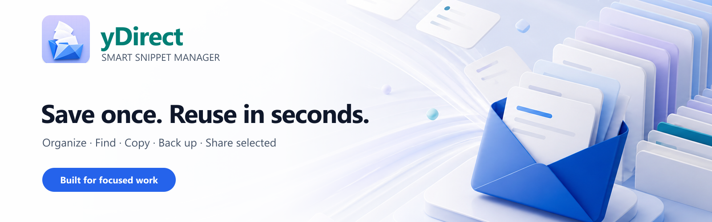
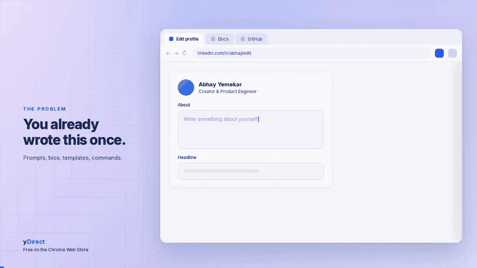
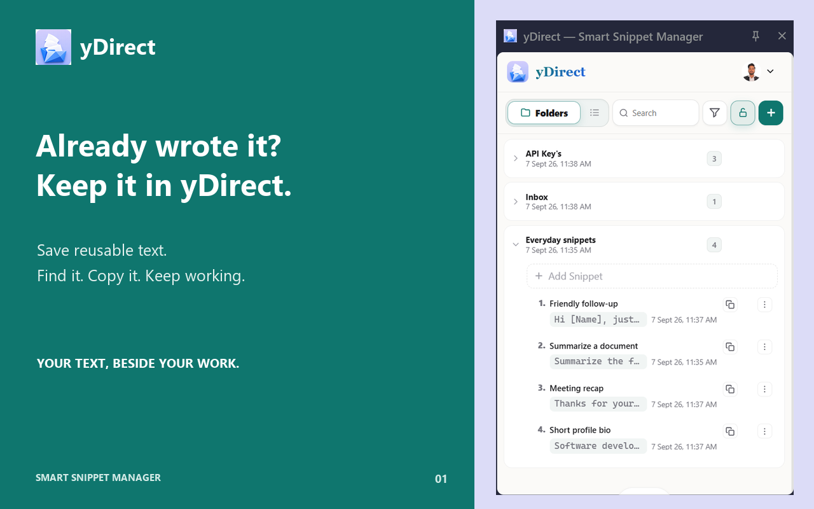
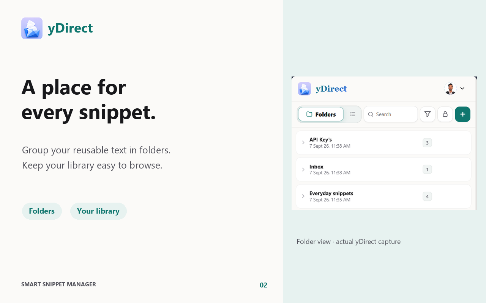
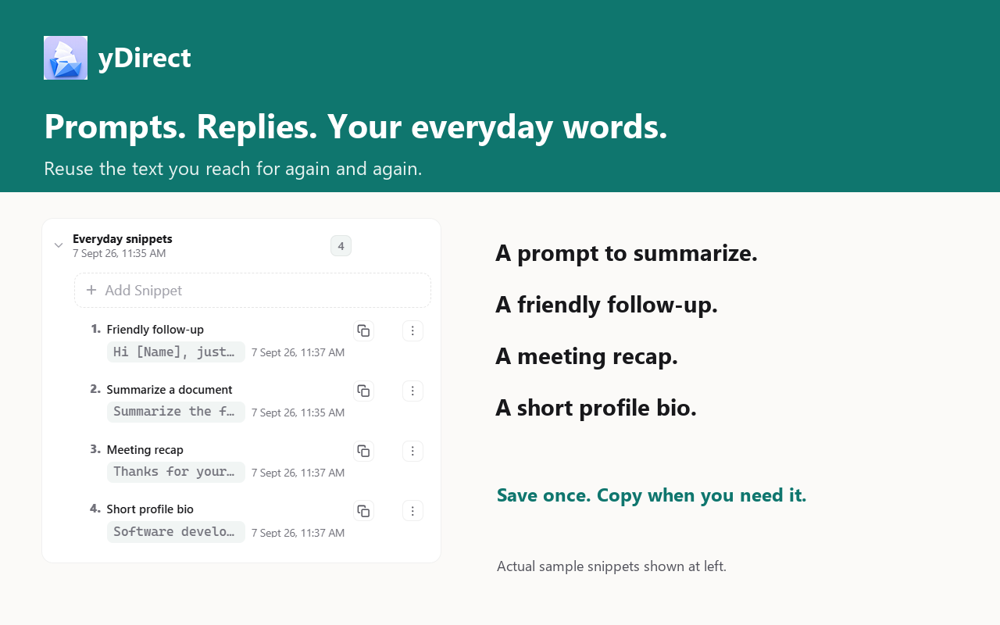
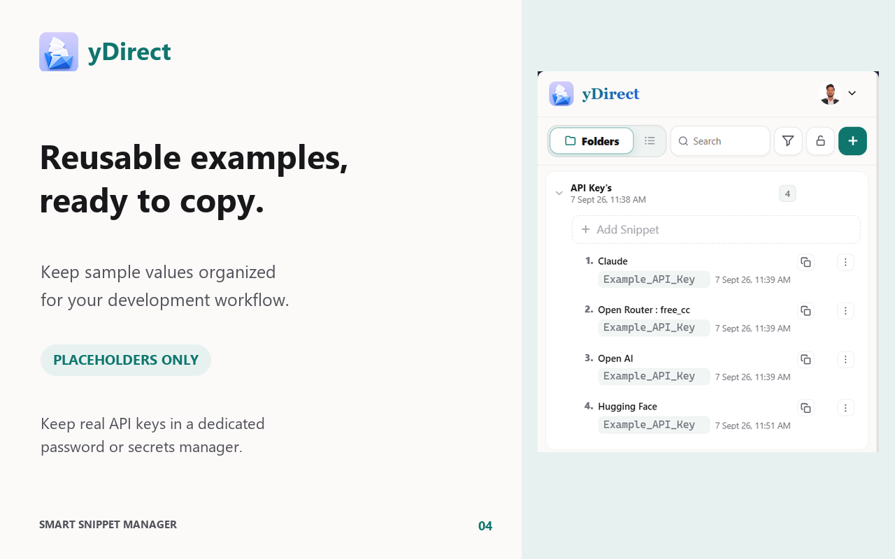
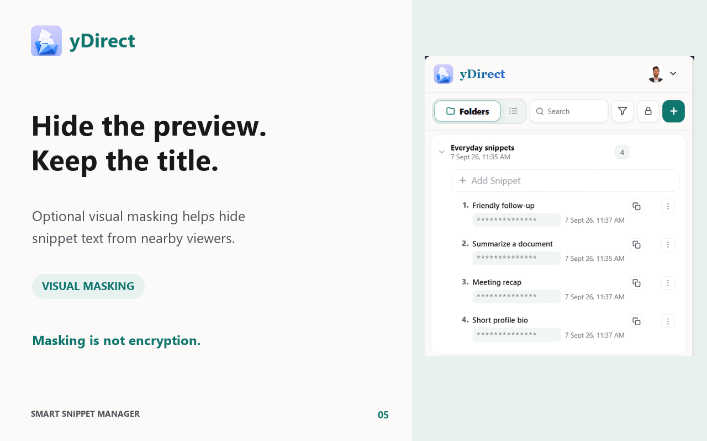
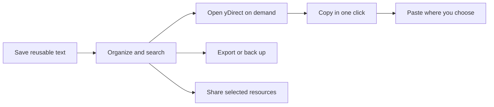
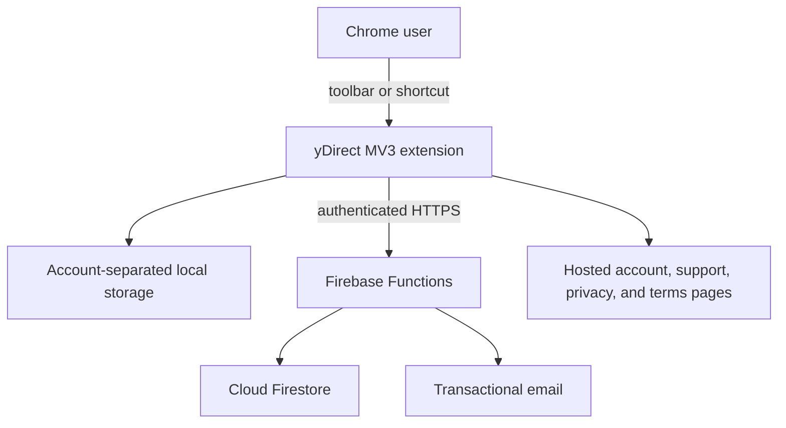

# yDirect — Snippet Manager for Chrome

  
  
  
  
  

  <strong>Your reusable text. Right beside your work.</strong> 
  Save prompts, templates, replies, bios, links, and code snippets—then search and copy them from Chrome's side panel without leaving your tab.

  <a href="https://chromewebstore.google.com/detail/ydirect-snippet-manager-s/ehkahipeoahnbfbahlkedgdcjefejihg"><strong>Install yDirect</strong></a> ·
  <a href="#see-it-in-action">See it in action</a> ·
  <a href="docs/FEATURES.md">Features</a> ·
  <a href="docs/PRIVACY-AND-PERMISSIONS.md">Privacy</a> ·
  <a href="https://inksl-ay.firebaseapp.com/support.html">Support</a>

> [!IMPORTANT]
> This is yDirect's official public product-showcase and documentation repository. The production extension and backend source, secrets, installable packages, private tests, and operational runbooks remain in a separate private repository.

## Stop rewriting text you already wrote

Useful text gets scattered across notes, old messages, documents, and memory. Every search breaks focus; every rewrite introduces drift.

yDirect turns that repeated text into an on-demand library in Chrome's native side panel. Open it, find the right snippet, copy it, and keep working.

| What | Why | How | Who |
| --- | --- | --- | --- |
| A focused snippet manager for Chrome | Reduce repetitive typing and context switching | Save, organize, search, copy, export, back up, and selectively share reusable text | Support, sales, recruiting, founders, developers, creators, students, and anyone who repeats text |

## Product demo

  <a href="assets/demo/ydirect-demo.mp4">Watch MP4</a> ·
  <a href="assets/demo/ydirect-product-tour.webm">Watch WebM</a> ·
  <a href="docs/INSTALLATION.md">Install and get started</a>

## See it in action

<table>
  <tr>
    <td width="50%"></td>
    <td width="50%"></td>
  </tr>
  <tr>
    <td align="center"><strong>Keep everyday text close</strong> Save once, find it, copy it, keep working.</td>
    <td align="center"><strong>A place for every snippet</strong> Use folders and list view as your library grows.</td>
  </tr>
  <tr>
    <td width="50%"></td>
    <td width="50%"></td>
  </tr>
  <tr>
    <td align="center"><strong>Prompts, replies, and everyday words</strong> Bring repeatable writing into one searchable place.</td>
    <td align="center"><strong>Reusable technical examples</strong> Keep templates and placeholders—not real secrets.</td>
  </tr>
</table>

  

<strong>Optional visual masking</strong> hides previews from nearby viewers. Masking is not encryption.

## Why yDirect

| | Capability | What it gives you |
| --- | --- | --- |
| ⚡ | Fast access | Open from the toolbar or `Alt+S`; copy a snippet in two clicks or fewer. |
| 🗂️ | Organized library | Folder and list views, search, sorting, timestamps, labels, and copy counts. |
| 📋 | Reliable copying | One-click copy plus `Alt+C` to reuse the most recently copied snippet. |
| 💾 | Local-first workflow | Keep an account-separated local copy of the working library in Chrome. |
| 🔐 | Portable data | Import and export JSON, passphrase-encrypted JSON, and Excel files. |
| ☁️ | Optional recovery | Enable cloud backup deliberately; retain the latest and previous recovery point. |
| 🤝 | Selective collaboration | Share chosen folders or snippets with verified yDirect accounts and role-based access. |
| 🌓 | Focused interface | Native side panel, compact account/settings views, light and dark themes, and keyboard-accessible dialogs. |

Read the [complete feature guide](docs/FEATURES.md), including role behavior, backup limits, and safety boundaries.

## What's new in 1.3.3

Published on September 8, 2026, version `1.3.3` focuses on reliability and clarity:

- improved returning-user startup and fixed delayed authentication loading for automatic backups;
- made workspace saves and retries conflict-safe while preserving genuine conflicts for reconciliation;
- confirmed sharing changes before closing and refreshed shared content in visible panels;
- compacted Profile, About, Feedback, and Settings panels;
- clarified sign-in method status and removed decorative bounce effects;
- retained the same eight Chrome permissions and single yDirect Functions host permission.

See the public [changelog](CHANGELOG.md) for the full release summary.

## Install in under a minute

1. Open the [official yDirect Chrome Web Store listing](https://chromewebstore.google.com/detail/ydirect-snippet-manager-s/ehkahipeoahnbfbahlkedgdcjefejihg).
2. Select **Add to Chrome**, review the permission summary, and confirm.
3. Pin yDirect, then click its toolbar icon or press `Alt+S` to open the side panel.
4. Sign in with Google or create an email/password account, then add your first folder and snippet.

Chrome `116` or newer is required. The core copy workflow requires a yDirect account. No unsigned package or source-based installation is distributed here. See [Installation](docs/INSTALLATION.md) for shortcuts, protected-page behavior, backup setup, and troubleshooting.

## How it works

```mermaid
flowchart LR
    A["Save reusable text"] --> B["Organize and search"]
    B --> C["Open yDirect on demand"]
    C --> D["Copy in one click"]
    D --> E["Paste where you choose"]
    B --> F["Export or back up"]
    B --> G["Share selected resources"]
```

The browser page never receives your library. yDirect runs in Chrome's browser-owned side panel. Temporary active-page access is used only to install or health-check the optional floating shortcut after your gesture.

## Privacy you can explain

- No advertising, sale of user data, browsing-history collection, or personalized ads.
- No persistent permission to read every website.
- Automatic cloud backup is off until the user enables it.
- Workspace features use authenticated, server-authorized requests.
- Exports start only when the user chooses an export action.
- Executable extension code is bundled in the reviewed Store package; backend responses do not deliver remote code.

> [!WARNING]
> yDirect is not a password manager. Do not store passwords, real API keys, private keys, recovery codes, payment-card data, or other highly sensitive secrets as ordinary snippets.

[Privacy Policy](https://inksl-ay.firebaseapp.com/privacy.html) · [Terms of Service](https://inksl-ay.firebaseapp.com/terms.html) · [Permission-by-permission explanation](docs/PRIVACY-AND-PERMISSIONS.md)

## Technology

| Layer | Technology |
| --- | --- |
| Browser experience | Chrome Extension Manifest V3, JavaScript modules, HTML, CSS, native `sidePanel` |
| Local data | `chrome.storage.local` with account-separated state |
| Identity | Firebase Authentication, Google OAuth, verified email accounts |
| Backend | Firebase Functions on Node.js 22 |
| Cloud data | Cloud Firestore with server-enforced authorization and retention rules |
| Public web | Firebase Hosting for account, support, privacy, terms, uninstall, and changelog pages |
| Transactional email | Resend with `ydirect.tech` sender identity; Cloudflare Email Routing for public inboxes |
| Quality | Automated data, UI, lifecycle, permissions, policy, package, and documentation checks through GitHub Actions |

```mermaid
flowchart TB
    U["Chrome user"] -->|"toolbar or shortcut"| X["yDirect MV3 extension"]
    X --> L["Account-separated local storage"]
    X -->|"authenticated HTTPS"| F["Firebase Functions"]
    F --> D["Cloud Firestore"]
    F --> E["Transactional email"]
    X --> H["Hosted account, support, privacy, and terms pages"]
```

This is an architectural view, not published implementation. Read [Architecture](docs/ARCHITECTURE.md) for responsibilities and trust boundaries.

## Product status

| Item | Status |
| --- | --- |
| Published version | `1.3.3` — published September 8, 2026 |
| Price | Free; no subscriptions, payments, advertising, or paid features in `1.3.x` |
| Platform | Google Chrome `116+`, Manifest V3 |
| Chrome Web Store | [Install from the official listing](https://chromewebstore.google.com/detail/ydirect-snippet-manager-s/ehkahipeoahnbfbahlkedgdcjefejihg) |
| Permanent item ID | `ehkahipeoahnbfbahlkedgdcjefejihg` |
| Production source | Private and proprietary |
| Public documentation | Maintained in this repository |
| Support | [support@ydirect.tech](mailto:support@ydirect.tech) |

## Documentation

| Document | Purpose |
| --- | --- |
| [Product brief](docs/PRODUCT.md) | Product problem, promise, audiences, principles, and use cases |
| [Feature guide](docs/FEATURES.md) | Capabilities, workspace roles, backup, portability, and boundaries |
| [Installation](docs/INSTALLATION.md) | Store installation, first run, shortcuts, and troubleshooting |
| [Architecture](docs/ARCHITECTURE.md) | High-level system design without production source |
| [Privacy and permissions](docs/PRIVACY-AND-PERMISSIONS.md) | Plain-language data model and Chrome permission rationale |
| [FAQ](docs/FAQ.md) | Product, account, backup, sharing, and licensing answers |
| [Roadmap](ROADMAP.md) | Public direction without release-date promises |
| [Media kit](docs/MEDIA-KIT.md) | Approved descriptions, public facts, owner bio, and brand assets |
| [Asset provenance](docs/ASSET-PROVENANCE.md) | Origin, safety, and intended use of showcase media |

## Public showcase boundary

| Included here | Kept private |
| --- | --- |
| Product documentation and approved screenshots | Extension, backend, infrastructure, and hosted-app source |
| Public architecture, privacy, roadmap, and changelog | Credentials, production configuration, and operational controls |
| Demo, promotional, and press-ready assets | Installable ZIP/CRX packages and signing material |
| Issue, support, security, and contribution processes | Private tests, release evidence, user data, and internal runbooks |

## Feedback and support

Ideas and reproducible non-sensitive product feedback are welcome through [GitHub Issues](https://github.com/abhay-yemekar/ydirect/issues). For help, use the [Support Center](https://inksl-ay.firebaseapp.com/support.html). Report vulnerabilities privately through [SECURITY.md](SECURITY.md).

If yDirect saves you time—or the product engineering behind it is useful to study—please **star this repository**. It helps an independent product reach more people who are tired of rewriting the same text.

## Owner

**Abhay Yemekar** 
Creator, Product Owner, and Maintainer of yDirect 
[abhay.yemekar@ydirect.tech](mailto:abhay.yemekar@ydirect.tech) · [GitHub](https://github.com/abhay-yemekar)

Product support: [support@ydirect.tech](mailto:support@ydirect.tech)

## License and ownership

The written documentation and original showcase media in this repository are available under [Creative Commons Attribution 4.0 International](LICENSE), except where a file states otherwise. The yDirect name, logo, and distinctive brand assets remain brand identifiers of Abhay Yemekar; the content license does not grant trademark rights.

The yDirect extension, backend, production source, deployment configuration, and related private software are proprietary and are **not** licensed by this repository. See [NOTICE.md](NOTICE.md).
