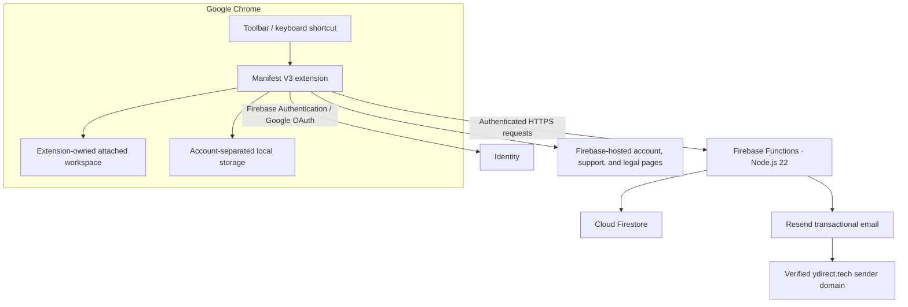

# Architecture overview

This document explains the public system design for yDirect `1.3.1`. It intentionally omits production source code, deployment secrets, internal identifiers beyond the public Chrome Web Store item ID, private runbooks, and exploitable control details.

## System view

## Browser layer

The production client is a Chrome Manifest V3 extension.

Responsibilities:

- render the popup and attached workspace;
- manage folders, snippets, search, sorting, themes, and copy actions;
- keep account-separated state in Chrome local storage;
- create and validate imports/exports;
- request authentication and authenticated cloud operations;
- attach the workspace to the active page only after a user gesture.

The attached panel runs in an extension-owned frame. The host page is not given the user's library.

## Identity layer

Firebase Authentication provides email/password accounts and the verified identity used by cloud features. Google OAuth is available when a user deliberately chooses Google sign-in.

Cloud backup, sharing, feedback, and account operations require authenticated requests. Protected collaboration actions require a verified email identity.

## Serverless backend

Firebase Functions on Node.js 22 handle account, backup, workspace, sharing, feedback, and transactional-notification operations.

The backend is the authorization boundary for cloud data. Client-side visibility or disabled controls are usability behavior, not a substitute for server checks.

## Cloud data

Cloud Firestore stores the cloud-side data needed for authenticated features, including workspace resources, grants, limited recovery data, rate-limit records, and durable account-operation jobs.

Authorization, payload limits, workspace scope, resource grants, revisions, and retention rules are enforced by server-side operations and configured data controls.

## Email and public web pages

- Firebase Hosting serves account, support, privacy, terms, uninstall, and changelog pages.
- Resend delivers transactional messages such as collaboration notifications and account-operation confirmations.
- `ydirect.tech` public addresses are routed through Cloudflare Email Routing.

Marketing email is not part of version `1.3.1`.

## Data flow examples

### Copy a local snippet

1. The user opens yDirect from the toolbar or keyboard.
2. The extension reads the signed-in account's local library.
3. The user selects a snippet.
4. The extension copies the text to the clipboard.
5. No cloud request is required for the ordinary local copy action.

### Back up to cloud

1. The signed-in user explicitly starts a backup or enables a schedule.
2. The extension sends an authenticated request to the yDirect backend.
3. The backend validates identity, payload, limits, and operation context.
4. The backup is stored as the latest recovery point while preserving one previous successful point.
5. The saved result is read back and checked before success is reported.

### Share a folder

1. A workspace manager selects a folder and verified recipient.
2. The backend validates the actor's role, workspace, resource, recipient, limits, and current revision.
3. A scoped resource grant is recorded.
4. A transaction notification may be sent without making email delivery a condition of the successful grant.
5. The recipient sees only the authorized resources after synchronization.

## Trust boundaries

| Boundary | Design intent |
| --- | --- |
| Host webpage ↔ extension frame | Keep the library in the extension context; do not disclose it to the page |
| Extension ↔ backend | Authenticated HTTPS to the yDirect Firebase Functions origin |
| Client UI ↔ authorization | Treat UI state as convenience; enforce cloud permissions on the server |
| Local data ↔ account | Separate browser-local state by signed-in account |
| Current state ↔ backup | Preserve explicit exports and two limited cloud recovery points |
| Product repo ↔ public docs repo | Keep implementation, secrets, packages, and operational evidence private |

## Technology choices

| Choice | Reason |
| --- | --- |
| Chrome Manifest V3 | Current Chrome extension platform and event-driven service-worker lifecycle |
| `activeTab` + `scripting` | User-triggered page attachment without persistent access to all sites |
| Chrome local storage | Fast local-first snippet access |
| Firebase Authentication | Email and Google identity with verified-account workflows |
| Firebase Functions | Authenticated, server-enforced product operations |
| Cloud Firestore | Structured workspace, recovery, and operational data with managed retention features |
| Firebase Hosting | HTTPS account and legal/support surfaces |
| Resend | Transactional delivery for product events |

## Availability and recovery

Local snippet use is designed not to depend on every cloud feature being available. Cloud backup is intentionally limited to two successful recovery points and is not represented as a full archive. Users remain responsible for independent exports of important data.

## Source availability

The high-level design is public for transparency and portfolio review. The production extension, backend, infrastructure configuration, tests, and release tooling are proprietary and live in a separate private repository.
