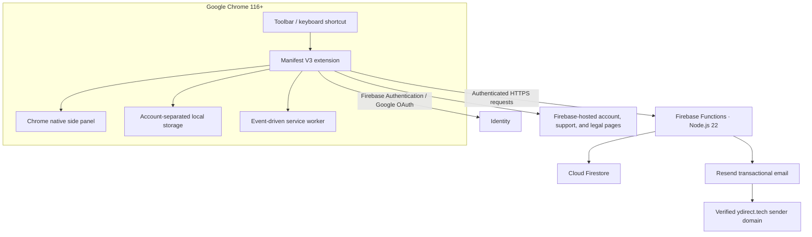

# Architecture overview

This document explains the public system design of yDirect `1.3.3`. It intentionally omits production source, deployment secrets, private identifiers beyond the public Chrome Web Store item ID, operational runbooks, and exploitable control details.

## System view

```mermaid
flowchart TB
    subgraph Browser["Google Chrome 116+"]
        T["Toolbar / keyboard shortcut"] --> M["Manifest V3 extension"]
        M --> P["Chrome native side panel"]
        M --> S["Account-separated local storage"]
        M --> W["Event-driven service worker"]
    end

    M -->|"Firebase Authentication / Google OAuth"| I["Identity"]
    M -->|"Authenticated HTTPS requests"| F["Firebase Functions · Node.js 22"]
    F --> D["Cloud Firestore"]
    F --> R["Resend transactional email"]
    M --> H["Firebase-hosted account, support, and legal pages"]
    R --> C["Verified ydirect.tech sender domain"]
```

## Browser layer

The production client is a Chrome Manifest V3 extension.

Responsibilities:

- render the popup and native side-panel workspace;
- manage folders, snippets, search, sorting, themes, and copy actions;
- keep account-separated state in Chrome local storage;
- create and validate imports and exports;
- request authentication and authenticated cloud operations;
- initialize authentication when an automatic-backup event wakes the worker;
- install or health-check the optional floating shortcut on the active supported page only after a user gesture.

The application runs in Chrome's browser-owned native side panel, not inside the website DOM. The host page is not given the user's library.

## Identity layer

Firebase Authentication provides email/password accounts and the verified identity used by cloud features. A Manifest V3-compatible Google account chooser uses a short-lived offscreen document and hosted callback helper without requesting Chrome's `identity` permission.

Cloud backup, workspace/sharing, feedback, and account operations require authenticated requests. Protected collaboration actions require a verified email identity. Cached consent can let a returning account access its local copy promptly while the current legal version is revalidated in the background.

## Serverless backend

Firebase Functions on Node.js 22 handle account, backup, workspace, sharing, feedback, and transactional-notification operations.

The backend is the authorization boundary for cloud data. Client-side visibility or disabled controls are usability behavior, not a substitute for server checks. Idempotent operations distinguish a successful retry from a true workspace revision conflict.

## Cloud data

Cloud Firestore stores cloud-side data needed for authenticated features, including workspace resources, grants, limited recovery data, rate-limit records, revisions, and durable account-operation jobs.

Authorization, payload limits, workspace scope, resource grants, revisions, and retention rules are enforced by server-side operations and configured data controls.

## Email and public web pages

- Firebase Hosting serves account, support, privacy, terms, uninstall, and changelog pages.
- Resend delivers transactional messages such as collaboration notifications and account-operation confirmations.
- `ydirect.tech` public addresses are routed through Cloudflare Email Routing.

Marketing email is not part of the `1.3.x` release line.

## Data-flow examples

### Copy a local snippet

1. The user opens yDirect from the toolbar or keyboard.
2. The extension reads the signed-in account's local library.
3. The user selects a snippet.
4. The extension writes that text to the clipboard.
5. No cloud request is required for this ordinary local copy action.

### Back up to cloud

1. The signed-in user explicitly starts a backup or enables a schedule.
2. The extension obtains current authentication and sends an authenticated request.
3. The backend validates identity, payload, limits, and operation context.
4. The latest recovery point is stored while preserving one previous successful point.
5. The saved result is read back and checked before success is reported.

### Share a folder

1. A workspace manager selects a folder and verified recipient.
2. The backend validates the actor's role, workspace, resource, recipient, limits, and current revision.
3. A scoped resource grant is recorded.
4. The client waits for confirmation before reporting success.
5. A transactional notification may be sent without making email delivery a condition of the grant.
6. The recipient sees authorized resources after synchronization; visible panels periodically refresh.

## Trust boundaries

| Boundary | Design intent |
| --- | --- |
| Host webpage ↔ native side panel | Keep the library in the extension context; do not disclose it to the page |
| Extension ↔ backend | Authenticated HTTPS to the yDirect Firebase Functions origin |
| Client UI ↔ authorization | Treat UI state as convenience; enforce cloud permissions on the server |
| Local data ↔ account | Separate browser-local state by signed-in account |
| Current state ↔ backup | Preserve explicit exports and two limited cloud recovery points |
| Workspace edits ↔ revisions | Preserve pending local work and surface genuine conflicts for reconciliation |
| Private product repo ↔ public showcase | Keep implementation, secrets, packages, tests, and operational evidence private |

## Technology choices

| Choice | Reason |
| --- | --- |
| Chrome Manifest V3 | Current Chrome extension platform and event-driven service-worker lifecycle |
| `sidePanel` | Browser-owned workspace surface separate from website DOM and policy rules |
| `activeTab` + `scripting` | Install or health-check only the optional shortcut on a user-activated supported page |
| `offscreen` | Support user-initiated Google sign-in without Chrome's `identity` permission |
| Chrome local storage | Fast local-first snippet access with account separation |
| Firebase Authentication | Email and Google identity with verified-account workflows |
| Firebase Functions | Authenticated, server-enforced product operations |
| Cloud Firestore | Structured workspace, recovery, and operational data with retention controls |
| Firebase Hosting | HTTPS account, support, privacy, terms, uninstall, and changelog surfaces |
| Resend | Transactional delivery for product events |

## Availability and recovery

Local snippet use is designed not to depend on every cloud feature being available. Cloud backup is intentionally limited to two successful recovery points and is not represented as a full archive. Users remain responsible for independent exports of important data.

## Source availability

The high-level design is public for transparency and portfolio review. The production extension, backend, infrastructure configuration, tests, packages, and release tooling are proprietary and live in a separate private repository.
